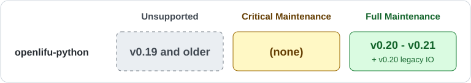

# Support schedule

This document defines the maintenance and support policy for the `openlifu`
python package.

## Release lines and patch releases

A **release line** is a `MAJOR.MINOR` version series, such as `0.20`.
Maintenance is delivered through patch releases. Only the **latest patch
release** within a supported line is supported; earlier patches are superseded.

## Maintenance tiers

- **Full Maintenance:** fixes for critical and noncritical issues.
- **Critical Maintenance:** fixes for critical issues only.
- **Unsupported:** no maintenance releases.

The
[desktop application](https://github.com/OpenwaterHealth/openlifu-desktop-application)'s
releases determine the support boundaries for openlifu, as described in the
[desktop application support schedule](https://github.com/OpenwaterHealth/openlifu-desktop-application/blob/main/SUPPORT.md):

- Full Maintenance runs from the latest release all the way back to the release
  line used in the latest openlifu-desktop-application release.
- Critical Maintenance runs back through the release line used for the previous
  openlifu-desktop-application release.

The
[release component version table](https://github.com/OpenwaterHealth/openlifu-desktop-application/blob/main/docs/release-component-version-table.md)
shows support status according to these rules.

With roughly two desktop release lines per year, support tiers may change every
six months or so. Support transitions follow actual releases; these durations
are not fixed calendar deadlines.

## Support at a glance

The graphic and table describe release lines. Always use the latest patch in a
supported line.

## What counts as critical?

Critical Support applies when fixes are needed to address circumstances such as
the following:

- Impacts to essential device performance, including safety-related issues
- Incorrectness of planning, simulation, or targeting
- Data loss or corruption
- Inability to perform core functionality with no reasonable workaround

## Temporary Exceptions

These follow the
[desktop application's temporary exceptions](https://github.com/OpenwaterHealth/openlifu-desktop-application/blob/main/SUPPORT.md#temporary-exceptions):

- The latest "legacy IO" release line is fully supported for now.
- `v0.18` and `v0.19` are Unsupported, rather than receiving Critical Support,
  because desktop application `v1.11` is Unsupported.
